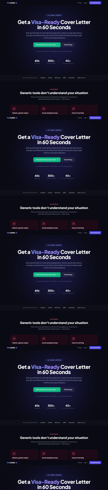
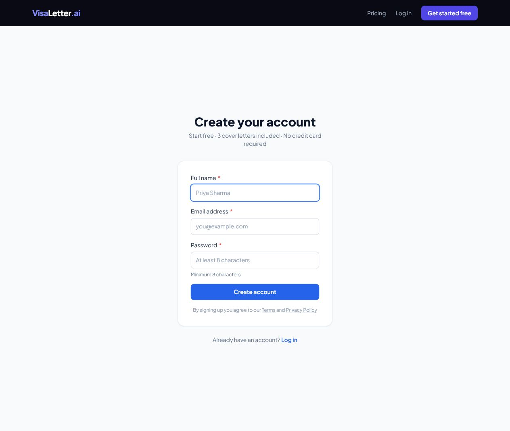
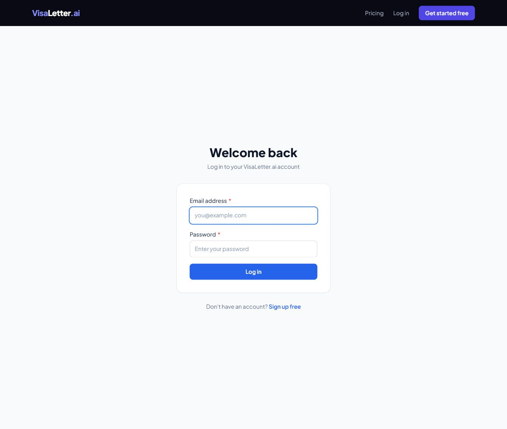

# VisaLetter.ai

VisaLetter.ai is a Next.js application for generating visa-aware cover letters for international job applicants. This checkout includes a marketing site, auth pages, protected dashboard and generation routes, API endpoints, Supabase wiring, and pricing flow scaffolding.

## Current status

- Repository state: runnable web app
- Product focus: AI-assisted cover letter generation for internationally mobile applicants
- Build status from this audit: Passed (`npm run build`)
- Lint status from this audit: Passed (`npm run lint`)
- Runtime status from this audit: Passed on `http://127.0.0.1:3011`
- Screenshot status: Real screenshots added from the running app

## Verified features from code

- Marketing landing page
- Pricing page
- Login and signup pages
- Protected dashboard, generation, and history routes
- API routes for generation history, AI generation, checkout, and Lemon Squeezy webhook handling
- Supabase client and server helpers
- AI provider abstraction in `lib/ai-providers.ts`

## Interface preview

### Landing page



### Login


### Signup



### Protected routes in local preview

Without a configured authenticated session, protected routes redirected to the real login screen during screenshot capture.



## Tech stack

- Next.js 14
- React 18
- TypeScript
- Tailwind CSS
- Supabase
- OpenAI and OpenRouter integration hooks
- Lemon Squeezy billing webhook route

## Setup

```powershell
npm install
Copy-Item .env.example .env.local
npm run lint
npm run build
npm run start -- --hostname 127.0.0.1 --port 3000
```

Minimum live credentials for full end-to-end verification:

```env
NEXT_PUBLIC_SUPABASE_URL=https://YOUR_PROJECT.supabase.co
NEXT_PUBLIC_SUPABASE_ANON_KEY=YOUR_SUPABASE_ANON_KEY
SUPABASE_SERVICE_ROLE_KEY=YOUR_SUPABASE_SERVICE_ROLE_KEY
NEXT_PUBLIC_SITE_URL=http://127.0.0.1:3000
OPENROUTER_API_KEY=YOUR_PROVIDER_KEY
```

Billing and webhook verification additionally require real Lemon Squeezy values.

## Testing

See [TESTING_GUIDE.md](./TESTING_GUIDE.md).

## Known limitations

- Protected routes require Supabase auth to reach their in-app state
- Payment, AI provider, and Supabase flows need real credentials to be fully exercised
- End-to-end paid generation flow is Not verified yet from this audit pass

## Roadmap

- Verify authenticated dashboard and generation flows with live credentials
- Add explicit rate-limit and provider fallback documentation
- Add automated tests for API routes and auth flows

## Repo docs

- [PROJECT_SUMMARY.md](./PROJECT_SUMMARY.md)
- [REAL_STATS.md](./REAL_STATS.md)
- [TESTING_GUIDE.md](./TESTING_GUIDE.md)
